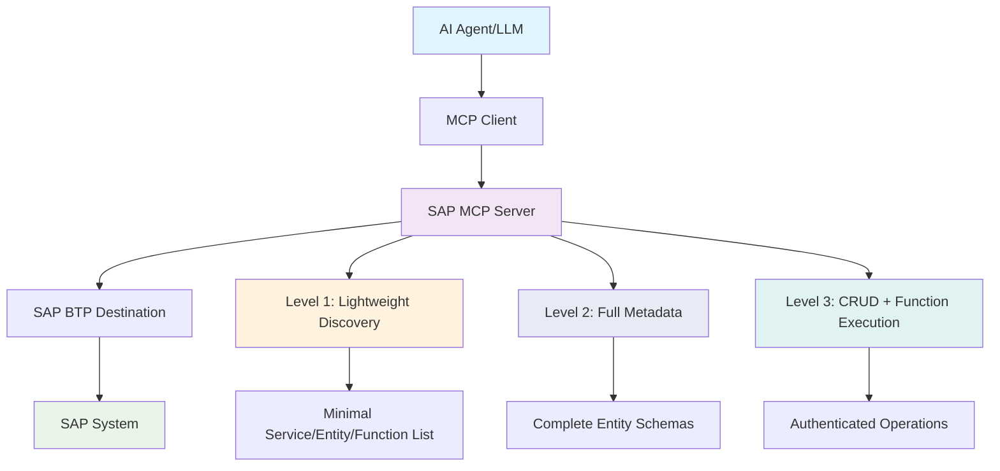

# SAP OData to MCP Server for BTP 🚀

## 🎯 **Project Goal**

Transform your SAP S/4HANA or ECC system into a **conversational AI interface** by exposing all OData services as dynamic MCP tools. This enables natural language interactions with your ERP data:

- **"Show me 10 banks"** → Automatically queries the Bank entity with `$top=10`
- **"Update bank with ID 1 to have street number 5"** → Executes PATCH on the Bank entity
- **"How many open purchase orders are there?"** → Uses the `count` operation via `/$count`
- **"Trigger the ApproveOrder function"** → Invokes an OData Function Import

## 🏗️ **Architecture Overview — 3-Level Progressive Discovery**


```mermaid
graph TB
    A[AI Agent/LLM] --> B[MCP Client]
    B --> C[SAP MCP Server]
    C --> D[SAP BTP Destination]
    D --> E[SAP System]

    C --> F[Level 1: Lightweight Discovery]
    F --> G[Minimal Service/Entity/Function List]
    C --> H[Level 2: Full Metadata]
    H --> I[Complete Entity Schemas]
    C --> J[Level 3: CRUD + Function Execution]
    J --> K[Authenticated Operations]

    style A fill:#e1f5fe
    style C fill:#f3e5f5
    style E fill:#e8f5e8
    style F fill:#fff3e0
    style H fill:#e8eaf6
    style J fill:#e0f2f1
```

### **Core Components**

1. **🔍 Level 1 — Discovery**: Lightweight search returning minimal service/entity/function lists (token-optimized)
2. **📋 Level 2 — Metadata**: Full schema details on-demand for a selected entity or function
3. **⚡ Level 3 — Execution**: Authenticated CRUD + Function Import operations
4. **🔌 MCP Protocol Layer**: Full compliance with MCP 2025-06-18 specification
5. **🌐 HTTP Transport**: Session-based Streamable HTTP for web applications
6. **🔐 BTP Integration**: Dual-destination authentication via SAP BTP Destination service

### **Why 3 Levels?**

A single SAP system can expose 100+ services, each with 10–50 entities. Returning all schemas upfront would blow the LLM context window. The progressive approach solves this:

| Level | Token Cost | Purpose |
|-------|-----------|---------|
| Level 1 | Very low — names only | Find what exists |
| Level 2 | Medium — one schema | Get details for one entity |
| Level 3 | None for metadata | Execute the operation |

With `includeSchema: true` on Level 1 (when ≤ 5 entities match), Levels 1 and 2 can be merged into a single call.

## ✨ **Key Features**

### **🔄 Full CRUD + Count + Function Imports**
- **read** — entity set with `$filter`, `$select`, `$expand`, `$orderby`, `$top`, `$skip`
- **read-single** — single entity by key
- **count** — total record count via `/$count` (token-free, no data returned)
- **create** — POST with CSRF token, supports one-level deep insert
- **update** — PATCH with CSRF token
- **delete** — DELETE with CSRF token
- **function** — OData Function Imports (GET) and Actions (POST), with typed parameters

### **📐 OData v2 & v4 Support**
- Automatic version detection from `$metadata` XML (`Version="4.0"`)
- v2: SAP annotation-based capabilities (`sap:creatable`, `sap:updatable`, …), `d.results` envelope, `$inlinecount=allpages`
- v4: Capability annotations (`Org.OData.Capabilities.V1`), `value` envelope, `$count=true`; Actions → POST, Functions → GET

### **🗓️ SAP Date Conversion**
- `/Date(timestamp)/` and `/Date(timestamp+HHMM)/` automatically converted to ISO 8601 (`2024-01-01T00:00:00.000Z`)
- Opt out per-deployment via `DISABLE_DATE_CONVERSION=true`

### **📦 Response Size Control**
- Hard item cap (`MAX_RESPONSE_ITEMS`, default 100) — excess items truncated with a warning
- Soft size warning (`MAX_RESPONSE_BYTES`, default 100 KB) — notifies when response is large
- Inline pagination hints (`skipNumber` / `topNumber` for next page) included automatically
- `$inlinecount` always requested so the LLM knows the total without fetching everything

### **🔐 Dual-Destination Authentication**
- **Discovery destination** (`SAP_DISCOVERY_DESTINATION_NAME`) — technical user, used for metadata and catalog calls
- **Execution destination** (`SAP_EXECUTION_DESTINATION_NAME`) — supports JWT forwarding (Principal Propagation) for data operations
- Single-destination fallback (`SAP_DESTINATION_NAME`) for backward compatibility

### **🚀 Production-Ready**
- Session management with automatic cleanup
- Deep SAP error extraction (`innererror.errordetails`) for actionable messages
- CSRF token + session cookie handling for write operations
- Helmet.js security headers, CORS, DNS rebinding protection

## 🏛️ **System Architecture**

```
┌─────────────────────┐    ┌───────────────────────────┐    ┌─────────────────────┐
│                     │    │                           │    │                     │
│   🤖 AI Agent       │    │   🖥️  SAP MCP Server     │    │   🏢 SAP            │
│   - Claude          │◄──►│   - Service Discovery     │◄──►│   - OData v2/v4     │
│   - GPT-4           │    │   - 3-Level Tool Registry │    │   - Function Imports│
│   - Local LLMs      │    │   - Session Management    │    │   - Business Logic  │
│                     │    │   - BTP Authentication    │    │   - Master Data     │
└─────────────────────┘    └───────────────────────────┘    └─────────────────────┘
                                           │
                                           ▼
                           ┌───────────────────────────┐
                           │                           │
                           │   ☁️  SAP BTP Platform    │
                           │   - Destination Service   │
                           │   - Connectivity Service  │
                           │   - XSUAA Security        │
                           │                           │
                           └───────────────────────────┘
```

## 📋 **Available Tools — 3-Level Architecture**

The server exposes **3 progressive discovery tools** instead of hundreds of individual CRUD tools.

---

### **Level 1: `discover-sap-data`**

**Purpose**: Search for SAP services, entities, and function imports. Returns minimal data optimized for LLM token efficiency.

**Parameters**:

| Parameter | Type | Description |
|-----------|------|-------------|
| `query` | string (optional) | Search term. Matches service names, entity names, function names. Omit to return everything. |
| `category` | string (optional) | `business-partner`, `sales`, `finance`, `procurement`, `hr`, `logistics`, `all` |
| `limit` | number (optional) | Max results. Default: 20. |
| `includeSchema` | boolean (optional) | Embed full entity schemas in Level 1 results. Only applied when ≤ 5 entities matched (avoids context bloat). Default: `false`. |

**Returns**: `serviceId`, `serviceName`, `entityCount`, `functionCount`, entity list, function list (with `httpMethod`, `returnType`)

**Fallback**: When no matches found, returns ALL services (sorted: available first).

**Usage**:
```javascript
// Search for customer entities
discover-sap-data({ query: "customer" })

// Single-pass: get schema immediately (if ≤ 5 entities match)
discover-sap-data({ query: "BankAccount", includeSchema: true })

// Browse everything
discover-sap-data({})
```

---

### **Level 2: `get-entity-metadata`**

**Purpose**: Get the complete schema for a specific entity or function import.

**Parameters**:

| Parameter | Type | Description |
|-----------|------|-------------|
| `serviceId` | string | From Level 1 results |
| `entityName` | string | Entity name or function name from Level 1 results |

**Returns**: All properties with types, nullable, maxLength, key fields, CRUD capabilities, navigation properties (with multiplicity), deep-insert guidance.

**Usage**:
```javascript
get-entity-metadata({
  serviceId: "API_BUSINESS_PARTNER",
  entityName: "BusinessPartner"
})
```

---

### **Level 3: `execute-sap-operation`**

**Purpose**: Perform authenticated operations on SAP entities or invoke Function Imports.

**Operations**:

| Operation | Description | Requires Level 2? |
|-----------|-------------|-------------------|
| `read` | Read entity set with optional filters | No (simple reads) |
| `read-single` | Read one entity by key | Yes (need key fields) |
| `count` | Total record count via `/$count` — no data returned | No |
| `create` | Create entity (POST) | Yes |
| `update` | Update entity (PATCH) | Yes |
| `delete` | Delete entity | Yes (need key fields) |
| `function` | Invoke OData Function Import or Action | Yes (need parameter names) |

**Key parameters**:

| Parameter | Type | Description |
|-----------|------|-------------|
| `serviceId` | string | From Level 1 results |
| `entityName` | string | Entity or function name |
| `operation` | string | One of the operations above |
| `parameters` | object | Key fields, function parameters, or create/update body |
| `filterString` | string | OData `$filter` value (without `$filter=`) |
| `selectString` | string | OData `$select` value — comma-separated properties |
| `expandString` | string | OData `$expand` value |
| `orderbyString` | string | OData `$orderby` value |
| `topNumber` | number | `$top` — records to return |
| `skipNumber` | number | `$skip` — offset for pagination |

**Usage**:
```javascript
// Read with filter and pagination
execute-sap-operation({
  serviceId: "API_BUSINESS_PARTNER",
  entityName: "BusinessPartner",
  operation: "read",
  filterString: "BusinessPartnerCategory eq '1'",
  topNumber: 20
})

// Count matching records (no data fetched)
execute-sap-operation({
  serviceId: "API_BUSINESS_PARTNER",
  entityName: "BusinessPartner",
  operation: "count",
  filterString: "BusinessPartnerCategory eq '1'"
})

// Invoke a Function Import
execute-sap-operation({
  serviceId: "ZAPI_PURCHASEREQ_PROCESS",
  entityName: "ReleasePurchaseRequisition",
  operation: "function",
  parameters: { PurchaseRequisition: "10000001" }
})

// Create with deep insert (one level)
execute-sap-operation({
  serviceId: "ZAPI_PURCHASEREQ_PROCESS",
  entityName: "PurchaseRequisitionHeader",
  operation: "create",
  parameters: {
    PurchReqnDescription: "Office supplies",
    to_PurchaseReqnItem: [
      { PurchReqnItemDescription: "Paper", Quantity: "10" }
    ]
  }
})
```

---

## 🗺️ **Recommended Workflows**

Choose the workflow that fits the task:

### ✅ Fast Workflow — Simple read (2 steps)
No schema needed for basic reads:
```
1. discover-sap-data { query: "X" }          → get serviceId + entityName
2. execute-sap-operation { operation: "read", topNumber: 10 }
```

### ✅ Single-Pass Workflow — Precise query (2 steps, schema embedded)
When your query is specific enough to match ≤ 5 entities:
```
1. discover-sap-data { query: "X", includeSchema: true }  → schema included
2. execute-sap-operation                                   → execute immediately
```

### ✅ Full Workflow — Write operations or filtered reads (3 steps)
Required for create/update/delete and read-single:
```
1. discover-sap-data { query: "X" }                  → get serviceId + entityName
2. get-entity-metadata { serviceId, entityName }      → get properties, keys, capabilities
3. execute-sap-operation                              → execute with correct parameters
```

## ⚙️ **Configuration**

All settings are via environment variables. See `.env.example` for a full reference.

### Destination Configuration

```env
# Separate destinations for discovery (technical user) and execution (JWT forwarding)
SAP_DISCOVERY_DESTINATION_NAME=SAP_SYSTEM_TECH
SAP_EXECUTION_DESTINATION_NAME=SAP_SYSTEM_SSO

# Or single destination (backward compatible)
SAP_DESTINATION_NAME=SAP_SYSTEM
```

### Service Discovery Filtering

```env
# Allow all services
ODATA_ALLOW_ALL=false

# Whitelist by glob patterns (comma-separated)
ODATA_SERVICE_PATTERNS=*BOOK*,*FLIGHT*,*TRAVEL*

# Exclude patterns
ODATA_EXCLUSION_PATTERNS=*_TEST*,*_TEMP*

# Maximum services to load (prevents overload)
ODATA_MAX_SERVICES=50

# Discovery mode: 'all', 'whitelist', 'regex'
ODATA_DISCOVERY_MODE=whitelist
```

### Response Size Control

```env
# Hard cap on items returned in a single read (excess truncated with a warning)
MAX_RESPONSE_ITEMS=100

# Soft cap on response size in bytes (warning added, no truncation)
MAX_RESPONSE_BYTES=102400
```

### Date Conversion

```env
# SAP /Date(timestamp)/ → ISO 8601. Set true only to keep raw SAP format.
DISABLE_DATE_CONVERSION=false
```

### Other

```env
# Tool registry type
MCP_TOOL_REGISTRY_TYPE=hierarchical

# Logging level: error | warn | info | debug
LOG_LEVEL=info

# Disable ReadEntity tool registration (for very large systems)
DISABLE_READ_ENTITY_TOOL=false
```

## 🔒 **Security & Authentication**

### SAP BTP Integration
- Uses BTP Destination service for S/4HANA or ECC authentication
- Supports **Principal Propagation**: data operations run under the authenticated user's SAP identity (full audit trail)
- Supports OAuth2 SAP XSUAA, Basic, and Client Certificate authentication
- Dual-destination model: discovery via technical user, execution via user JWT

### HTTP Security
- Helmet.js security headers
- CORS protection with configurable origins
- DNS rebinding attack prevention
- Request rate limiting (configurable)

### Session Security
- Automatic session expiration (24h default)
- Secure session ID generation
- Session cleanup on server restart

## 📚 **API Reference**

### Health Check
```http
GET /health
{
  "status": "healthy",
  "activeSessions": 3,
  "discoveredServices": 25,
  "version": "2.0.0"
}
```

### Server Info
```http
GET /mcp
{
  "name": "btp-sap-odata-to-mcp-server",
  "protocol": { "version": "2025-06-18" },
  "capabilities": { "tools": {}, "resources": {} }
}
```

### MCP Capabilities
- ✅ **Tools** with `listChanged` notifications
- ✅ **Resources** with `listChanged` notifications
- ✅ **Logging** with level control
- ✅ **Session Management** for HTTP transport
- ✅ **Streamable HTTP** and **Stdio** transports

## 🎬 Demo

See the MCP server in action:


## ⚡ Quick Start

- For local development and testing, see [LOCAL_RUN.md](./docs/LOCAL_RUN.md)
- For deployment to SAP BTP, see [DEPLOYMENT.md](./docs/DEPLOYMENT.md)
